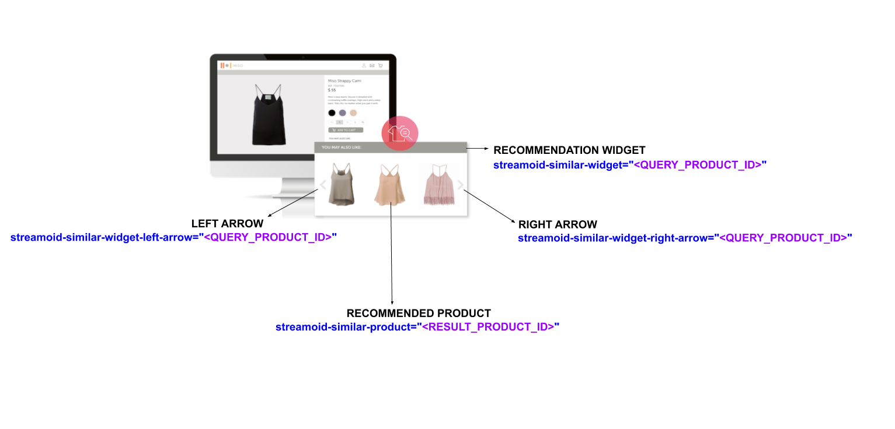

**Barebones-JS**
===================

**Barebones-JS** is a Javascript SDK which allows fashion clients to use Streamoid's fashion intelligence for recommendations without a fixed UI template. Clients can use the SDK to build custom UI components which fit seamlessly within their own websie with the same look and feel as a widget. 

**Streamoid's services:**

The below services can be accessed via the SDK:

1) Similar: Find products that are similar to the one the user is looking at. 

**Integration**

1) Adding the SDK script

Add the below script within the **head** tag

```
(function(i,s,o,g,r,t,k,a,m){
         i['PiqitObject']=r;i['PiqitGa']=t;i['PiqitToken'] = k;i[r]=i[r]||function() {
         (i[r].q=i[r].q||[]).push(arguments)},i[r].l=1*new Date();a=s.createElement(o),
         m=s.getElementsByTagName(o)[0];a.async=1;a.src=g;m.parentNode.insertBefore(a,m)
         })(window, document, 'script', 'LOADER-URL', 'PQT', 'GA TRACKER-ID', 'CLIENT TOKEN');
```     

Please contact streamoid.support@streamoid.com to get your LOADER-URL, CLIENT TOKEN, GA TRACKER-ID

2) Enabling Analytics

a) User engagement with the widget can be tracked via the SDK. To do so, add the data-attributes shown in the below diagram to the appropriate UI elements. 



The left and right arrows can be clicked upon by the user to see more recommeneded products. 

b) Clickthroughs 

To track Clickthroughs post clicking on a recomended product, ensure that the following query string parameters are appeneded to URL the user is taken to:

?source=similar#strmd_simpar=<QUERY_PRODUCT_ID>#strmd_sim=<RECOMMENDED_PRODUCT_ID>

Usage of query string parameters, 

**source**
Indicates that the clickthrough has come from the SDK's similar recommendations

**strmd_simpar**
Parent product ID which recommened the new product viewed via the redirect 

**strmd_sim**
Recommened product ID

**Sample usage**

Once the script has been added in the head tag as shown above, Streamoid's services can be called by invoking the below functions via the PQT_barebones namespace. 

1) Similar
```
PQT_barebones.findSimilar(<QUERY_PRODUCT_ID>,function(data){console.log(data)})
```

Here, 

**<QUERY_PRODUCT_ID>** is the id of the product which at the user is looking. Similar products can be found via the **findSimilar** method respectively.

**function(data){console.log(data)}** is a custom callback that receives the similar products/complementary products for the outfit as JSON in **data**. The JSON can be used to build UI elements and rendered on the fashion website as a widget. 

Sample response:

```
{"status": {"message": "Success", "code": 1000}, "data": {"products": ["5727536", "5680638", "5709644", "5709722", "5430577"], "queryData": "5685418"}}
```

Here, 
**status** Indicates the success of the API call 
- message: "Success" indicates that the API call has been successful

**data** Contains the recommended products 
- products is an array containing all of the recommended product ids 


